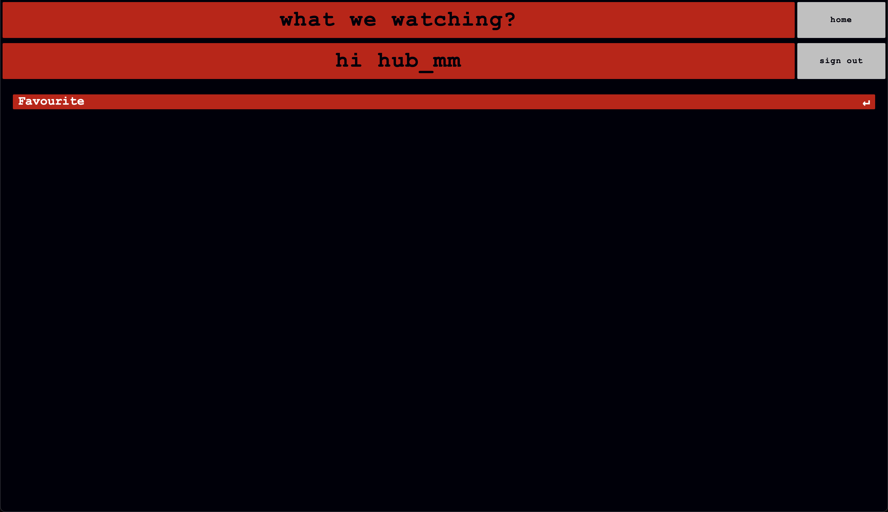

# MOVIE RECOMMENDATION
This project is a Flask-based web application that recommends and displays films through various interfaces and
filtering options. It interacts with a collection of data files downloaded from Kaggle, processes them, and
then uses both content-based and collaborative filtering methods to generate film recommendations. 
The application also allows you to view random selections of films, filter by genre, and view top-rated lists.

## Table of Content
- [Features](#features)
- [Front End / Back End](#front-end-back-end)
  - [Front End](#front-end)
  - [Back End](#back-end)
- [Tech Stack](#tech-stack)
- [Prerequisites](#prerequisites)
- [Installation](#installation)
- [Project Structure](#project-structure)
- [Screenshots](#screenshots)
- [Usage](#usage)
- [Notes](#notes)
- [Contributions](#contributions)
- [Author](#author)

## Features
- **Top-Rated Films:** Displays a curated list of films based on weighted rating scores.
- **Genre-Based Filtering:** Lets you select a genre (such as action) and fetches films that belong to that category.
- **Collaborative + Content-Based Filtering:** Combines user rating data with film metadata to produce improved recommendations
(via SVD from the surprise library).
- **Random Selection:** Fetches a random set of film posters with details like release date and production companies.
- **Interactive Web Interface:**  Built with Flask, features dynamic routes and a JavaScript front end for toggling
between poster images and film details.

## Front End /Back End
### Front End
- Uses **HTML, CSS and Javascript** to present film information and styling on the user-facing side.
- Contains clickable film posters that reveal more information upon flipping.
- **JavaScript** (script.js) manages DOM manipulation, toggling between poster images and additional film details, 
and controlling which buttons are active.
### Back End
- Based on **Python 3.12+** and the **Flask framework**, handling routes (/home, /rating, /genre, /similar) and query parameters.
- Employs **pandas** and **scikit-learn** for data wrangling and content-based filtering (cosine similarity).
- Uses **surprise** for training and loading the **SVD model** to incorporate collaborative filtering.

## Tech Stack
- **Python 3.12+**
- **Flask** – Web framework
- **pandas** - Data handling and analysis
- **scikit-learn** – Cosine similarity for content-based filtering
- **surprise** – Collaborative filtering (SVD model)
- **requests** – Checking poster validity
- **HTML/CSS/JavaScript** – For the web front end

## Prerequisites
- Python 3.12 or above installed on your machine.
- Kaggle API credentials if you wish to download the dataset automatically. 
Otherwise, place the “movies dataset” files in the correct location manually.

## Installation
1. **Clone this Repository:**
    ```bash
    git clone https://github.com/hub-mm/movie_recommendation_system.git
    ```
2. **Navigate to project folder:**
    ```bash
    cd movie_recommendation
    ```
3. **Install required Python packages:**
    ```bash
    pip install -r requirements.txt
    ```
4. **(Optional) Download Kaggle dataset:**
- Ensure your Kaggle CLI is set up and your kaggle.json credentials are correctly configured.
- The script data_download.py will automatically fetch the dataset and place it in ./data/movies_dataset/7/ if not already present.

## Project Structure
```bash
    .
    ├── README.md
    ├── app
    │   ├── static
    │   │   ├── script.js
    │   │   └── style.css
    │   ├── templates
    │   │   ├── genre.html
    │   │   ├── index.html
    │   │   ├── new_user.html
    │   │   ├── rating.html
    │   │   ├── sign_in.html
    │   │   ├── similar.html
    │   │   └── user_page.html
    │   └── web_app.py
    ├── config.py
    ├── data
    │   ├── movies_dataset
    │   │   └── 7
    │   │       ├── credits.csv
    │   │       ├── keywords.csv
    │   │       ├── links.csv
    │   │       ├── links_small.csv
    │   │       ├── movies_metadata.csv
    │   │       ├── ratings.csv
    │   │       └── ratings_small.csv
    │   └── user_built
    │       ├── cosine_sim.pkl
    │       ├── count_vectorizer.pkl
    │       ├── indices.pkl
    │       ├── preprocessed_df.pkl
    │       └── preprocessed_df_movies.pkl
    ├── main.py
    ├── model
    │   └── model_filtering.pkl
    ├── requirements.txt
    └── scripts
        ├── build_model
        │   └── build_model_collab_filtering.py
        ├── data_management
        │   ├── data_download.py
        │   ├── data_merge_hybrid.py
        │   ├── data_merge_similar.py
        │   ├── data_preprocess_credits.py
        │   ├── data_preprocess_keywords.py
        │   ├── data_preprocess_links.py
        │   ├── data_preprocess_movies_metadata.py
        │   ├── data_preprocess_movies_metadata_posters.py
        │   └── data_preprocess_ratings.py
        ├── script_app
        │   ├── random_image.py
        │   └── script_users.py
        └── top_chart
            ├── top_chart_genre.py
            ├── top_chart_hybrid.py
            ├── top_chart_rating.py
            └── top_chart_similar.py
```
- app/web_app.py: Main Flask application file defining the routes.
- app/templates/*.html: HTML templates for each route (home, rating, genre, similar).
- app/static/: Contains JavaScript and CSS for the front end.
- scripts/data_management/: Scripts to download, preprocess, and merge datasets.
- scripts/top_chart/: Scripts generating top charts or recommendations based on various criteria.
- scripts/script_app/random_image.py: Provides random film posters.
- scripts/script_app/script_users.py: User class.
- model/: Stores the pickled collaborative filtering model.

## App Screenshots
### Home menu

### Menu Options

### Similar Films to Avatar
***Some film images arent available due to possible old link.  
Home menu filters through images to try minimise redundant links.***

### Choose How Many Films To Display

### Login Page

### Create User Page

### Add Film To Favourite 

### User Page

### User Page Favourite Films


## Usage
1. **Run the Flask App:**
    ```bash
    python -m app.web_app
    ```
2. **Access the Web Interface:**
   - By default, navigate to: http://localhost:8000/home
   - Use the buttons in the menu to switch pages:
     - **Home** - random selection
     - **Genre** - filter by genre
     - **Rating** - top-rated films
     - **Similar** -  find similar films using hybrid filtering
     - **Login and Create User** - log in to start session and have user specific info
     - **User Page** - page with user specific favourite films
3. **Adjust Parameters:**
- Use the query parameters in the URL or the interface’s text input to control the number of films displayed, 
the genre choice, or the film title for similarity.

## Notes
- If the dataset or model is not found locally, the first run may attempt to download and preprocess everything, which could take a while.
- Some scripts (e.g., build_model_filtering.py) train or reload the collaborative filtering model. Ensure you have sufficient system resources (CPU/RAM).

## Contributions
Contributions, suggestions, and improvements are welcome. Feel free to open an issue or submit a pull request.

## Author
Created by hub-mm. For queries, feel free to reach out or open a GitHub issue. Enjoy discovering new films!